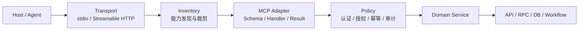

# MCP 最佳落地实践：从 Server 开发到生产治理

MCP（Model Context Protocol）是 Agent 与外部能力之间的标准协议。它与编程语言无关：Server 可以用 Python、Go、TypeScript 等任意语言实现，也可以继续调用既有 HTTP、RPC、数据库和工作流。语言只影响 SDK 与工程生态，真正需要长期维护的是 **Tool Contract（工具契约）、能力发现、执行权限、结果语义和运行治理**。

> [!summary] 核心结论
> 一个生产级 MCP Server 不是“套一层协议的 API 代理”，而是 Agent 的能力边界：只暴露适合模型使用的能力，在服务端强制执行身份、授权、幂等、数据隔离和审计，并把 Tool Contract（工具契约） 当作正式 API 管理。

## 一、MCP 的位置与边界

### 1. Host、Client 与 Server

```text
用户
  → Host / Agent：组织上下文、调用模型、审批高风险动作
  → MCP Client：初始化连接、发现能力、发起协议调用
  → MCP Server：校验身份和参数、执行工具、整形结果
  → 业务系统：HTTP API / RPC / DB / Search / Workflow
```

MCP Server 主要提供三类能力：

| 能力 | 用途 | 典型场景 |
| --- | --- | --- |
| Tools | 执行计算或动作，可产生副作用 | 查询订单、创建工单、触发工作流 |
| Resources | 读取可寻址的上下文数据 | 文档、配置、报告、大结果详情 |
| Prompts | 提供可复用的交互模板 | 代码审查模板、领域分析流程 |

不要把所有能力都包装成 Tool。可寻址数据优先用 Resource；固定的多步业务路径应先在服务端实现为 Workflow，再暴露一个高层 Tool。

### 2. 与 Function Calling、HTTP API、A2A 的区别

| 机制 | 主要解决的问题 |
| --- | --- |
| Function Calling | 模型如何结构化表达“想调用哪个函数” |
| MCP | Host 如何发现、连接并调用外部能力 |
| HTTP / RPC | 确定性服务之间如何通信 |
| A2A | 具备独立目标和状态的 Agent 如何协作 |

MCP 不负责模型规划，也不会自动带来安全性。Tool 注解、Host 审批和 Server 授权是三层不同机制：**注解是提示，审批是交互保护，Server 授权才是最终安全边界。**

## 二、企业级 MCP Server 的分层



推荐将职责拆成五层：

1. **Transport**：处理 stdio 或 Streamable HTTP，不承载业务逻辑。
2. **Inventory**：决定当前部署或场景暴露哪些能力。
3. **MCP Adapter**：定义 Tool Schema、调用业务服务、映射错误和结果。
4. **Policy**：从认证上下文取得主体，强制执行 scope、租户、幂等与审计。
5. **Domain Service**：复用既有业务能力，不感知模型和 MCP 协议。

`ToolSpec`、`Toolset`、`Inventory` 不是 MCP 规范字段，而是值得在大型 Server 内部建立的治理抽象。它们解决“系统拥有的工具”与“当前应该暴露的工具”不是同一个集合的问题。

## 三、用官方 Python SDK 从 0 到 1 开发

本文示例使用官方 Python SDK 的稳定 v1 API。编写本文时 v2 仍处于预发布阶段，因此生产依赖设置 `<2` 上界；升级前应重新检查[官方仓库的版本说明](https://github.com/modelcontextprotocol/python-sdk)。

### 1. 初始化项目

```bash
uv init enterprise-mcp
cd enterprise-mcp
uv add "mcp[cli]>=1.27,<2" "pydantic>=2,<3" "httpx>=0.27,<1"
uv add "pyjwt[crypto]>=2.10,<3"
uv add --dev "pytest>=8,<9" "anyio>=4,<5" "inline-snapshot>=0.31,<1"
```

```text
app/
├── server.py          # FastMCP、lifespan、transport
├── auth.py            # TokenVerifier
├── remote.py          # 生产远程入口
├── context.py         # 请求依赖、认证主体
├── models.py          # 输入输出契约
├── registry.py        # ToolSpec、Toolset、Inventory
├── tools/
│   └── orders.py      # MCP 适配层
└── services/
    └── orders.py      # 业务服务适配器
tests/
├── test_orders.py
└── test_contracts.py
```

Tool 层不应直接创建数据库连接或 HTTP Client。共享依赖由 `lifespan` 初始化，通过强类型 Context 注入；这样启动失败、资源回收和测试替换都有明确边界。

### 2. 先定义输入输出契约

```python
# app/models.py
from typing import Annotated, Literal

from pydantic import BaseModel, Field

OrderId = Annotated[
    str,
    Field(pattern=r"^ord_[A-Za-z0-9]{8,32}$", description="订单号"),
]
CancelReason = Annotated[
    str,
    Field(min_length=3, max_length=200, description="取消原因，不得包含敏感信息"),
]
IdempotencyKey = Annotated[
    str,
    Field(min_length=16, max_length=128, description="调用方生成的幂等键"),
]


class OrderDetail(BaseModel):
    order_id: str
    status: Literal["created", "paid", "shipped", "cancelled"]
    amount_minor: int = Field(ge=0, description="最小货币单位金额")
    currency: str = Field(pattern=r"^[A-Z]{3}$")
    tracking_summary: str | None = None


class CancelOrderResult(BaseModel):
    order_id: str
    status: Literal["cancelled"]
    operation_id: str
    already_applied: bool
```

Pydantic 类型同时用于参数校验、`inputSchema`、`outputSchema` 和返回值验证。不要使用无约束的 `dict[str, Any]` 承载核心 Contract，也不要把上游完整 JSON 原样返回给模型。

### 3. 将身份和业务能力做成请求依赖

```python
# app/context.py
from dataclasses import dataclass
from typing import Protocol

from mcp.server.auth.middleware.auth_context import get_access_token
from mcp.server.fastmcp.exceptions import ToolError

from app.models import CancelOrderResult, OrderDetail

ORDER_READ = "orders:read"
ORDER_WRITE = "orders:write"


@dataclass(frozen=True)
class Principal:
    subject: str
    scopes: frozenset[str]


class PrincipalProvider:
    def require(self, scope: str) -> Principal:
        token = get_access_token()
        if token is None or token.subject is None:
            raise ToolError("AUTH_REQUIRED: authentication is required")
        if scope not in token.scopes:
            raise ToolError("PERMISSION_DENIED: required scope is missing")
        return Principal(token.subject, frozenset(token.scopes))


class OrderService(Protocol):
    async def get_visible_order(
        self, principal: Principal, order_id: str
    ) -> OrderDetail | None: ...

    async def cancel_order(
        self,
        principal: Principal,
        order_id: str,
        reason: str,
        idempotency_key: str,
    ) -> CancelOrderResult: ...


class AuditSink(Protocol):
    async def record(
        self, *, subject: str, tool: str, resource_id: str, outcome: str
    ) -> None: ...


@dataclass
class ToolDependencies:
    orders: OrderService
    audit: AuditSink
    principals: PrincipalProvider


class OrderStateConflict(Exception):
    pass


class DependencyUnavailable(Exception):
    pass
```

身份必须来自经过验证的 Token 或本地受信任进程边界，不能让模型传入 `user_id`、`tenant_id`、角色或“已经批准”字段。下游服务仍应再次执行对象级授权，避免 MCP Server 成为越权代理。

### 4. Tool Handler 只做协议适配

```python
# app/tools/orders.py
import secrets

from mcp.server.fastmcp import Context
from mcp.server.fastmcp.exceptions import ToolError
from mcp.server.session import ServerSession

from app.context import (
    DependencyUnavailable,
    ORDER_READ,
    ORDER_WRITE,
    OrderStateConflict,
    ToolDependencies,
)
from app.models import (
    CancelOrderResult,
    CancelReason,
    IdempotencyKey,
    OrderDetail,
    OrderId,
)


async def get_order_detail(
    order_id: OrderId,
    ctx: Context[ServerSession, ToolDependencies],
) -> OrderDetail:
    """查询当前主体可访问的订单摘要；订单号未知时不要调用。"""
    deps = ctx.request_context.lifespan_context
    principal = deps.principals.require(ORDER_READ)
    order = await deps.orders.get_visible_order(principal, order_id)
    if order is None:
        # 合并“不存在”和“无权访问”，避免枚举其他用户的订单。
        raise ToolError("ORDER_NOT_FOUND: order is unavailable")
    return order


async def cancel_order(
    order_id: OrderId,
    reason: CancelReason,
    idempotency_key: IdempotencyKey,
    ctx: Context[ServerSession, ToolDependencies],
) -> CancelOrderResult:
    """取消尚未履约的订单；这是写操作，调用前必须向用户展示参数并确认。"""
    deps = ctx.request_context.lifespan_context
    principal = deps.principals.require(ORDER_WRITE)

    try:
        result = await deps.orders.cancel_order(
            principal, order_id, reason, idempotency_key
        )
    except OrderStateConflict as exc:
        raise ToolError("ORDER_STATE_CONFLICT: order cannot be cancelled") from exc
    except DependencyUnavailable as exc:
        trace_id = secrets.token_hex(8)
        await ctx.error(f"order dependency unavailable; trace_id={trace_id}")
        raise ToolError(
            f"TEMPORARILY_UNAVAILABLE: retry later; trace_id={trace_id}"
        ) from exc

    await deps.audit.record(
        subject=principal.subject,
        tool="cancel_order",
        resource_id=order_id,
        outcome="already_applied" if result.already_applied else "cancelled",
    )
    return result
```

这里有四个关键点：

- Tool 参数只包含完成任务所需的业务信息，不包含认证身份。
- 返回 Pydantic Model，让 SDK 生成并校验结构化输出。
- 预期业务错误使用 `ToolError`，内部异常只向客户端暴露稳定错误码和 trace ID。
- 写操作使用幂等键；Server 与下游都不能依赖模型“只调用一次”。

### 5. 用 Inventory 控制能力暴露

成熟 Server 不应把所有 Tool 无条件注册。把元数据集中为 `ToolSpec`，再根据部署场景、只读模式和 feature flag 生成 Inventory：

```python
# app/registry.py
from collections.abc import Callable, Iterable
from dataclasses import dataclass
from typing import Any

from mcp.server.fastmcp import FastMCP
from mcp.types import ToolAnnotations


@dataclass(frozen=True)
class ToolSpec:
    name: str
    description: str
    handler: Callable[..., Any]
    toolset: str
    required_scopes: frozenset[str]
    read_only: bool
    destructive: bool = False
    idempotent: bool = False
    feature_flag: str | None = None


@dataclass(frozen=True)
class InventoryPolicy:
    allowed_toolsets: frozenset[str]
    granted_scopes: frozenset[str]
    enabled_flags: frozenset[str]
    read_only: bool = False


def select_tools(
    specs: Iterable[ToolSpec], policy: InventoryPolicy
) -> list[ToolSpec]:
    return [
        spec
        for spec in specs
        if spec.toolset in policy.allowed_toolsets
        and spec.required_scopes <= policy.granted_scopes
        and (not policy.read_only or spec.read_only)
        and (
            spec.feature_flag is None
            or spec.feature_flag in policy.enabled_flags
        )
    ]


def register_tools(
    mcp: FastMCP, specs: Iterable[ToolSpec], policy: InventoryPolicy
) -> None:
    for spec in select_tools(specs, policy):
        mcp.add_tool(
            spec.handler,
            name=spec.name,
            description=spec.description,
            annotations=ToolAnnotations(
                readOnlyHint=spec.read_only,
                destructiveHint=spec.destructive,
                idempotentHint=spec.idempotent,
                openWorldHint=False,
            ),
        )
```

Inventory 的过滤是**能力暴露策略**，不是执行授权。即使 Tool 没有出现在 `tools/list`，Server 在 `tools/call` 和下游服务处仍必须校验主体、scope、租户和对象权限。

当工具很多时，按业务域形成 Toolset；按部署、租户或场景只暴露必要集合。若需要“每个请求看到不同工具”，可使用低层 Server 自定义 `tools/list`，或提供按权限隔离的端点，但不要让动态发现替代 Handler 授权。

### 6. 组装 Server 与生命周期

```python
# app/server.py
import os
from collections.abc import AsyncIterator
from contextlib import asynccontextmanager

import httpx
from mcp.server.fastmcp import FastMCP

from app.context import (
    ORDER_READ,
    ORDER_WRITE,
    PrincipalProvider,
    ToolDependencies,
)
from app.registry import InventoryPolicy, ToolSpec, register_tools
from app.services.orders import HttpOrderService, StructuredAuditSink
from app.tools.orders import cancel_order, get_order_detail


@asynccontextmanager
async def app_lifespan(_: FastMCP) -> AsyncIterator[ToolDependencies]:
    timeout = httpx.Timeout(connect=2.0, read=5.0, write=5.0, pool=2.0)
    async with httpx.AsyncClient(
        base_url=os.environ["ORDER_API_URL"],
        timeout=timeout,
    ) as http:
        yield ToolDependencies(
            orders=HttpOrderService(http),
            audit=StructuredAuditSink(),
            principals=PrincipalProvider(),
        )


TOOLS = (
    ToolSpec(
        name="get_order_detail",
        description=(
            "根据已知订单号查询当前主体可访问的订单摘要；"
            "不返回支付凭证或完整地址，订单号未知时不要调用。"
        ),
        handler=get_order_detail,
        toolset="orders",
        required_scopes=frozenset({ORDER_READ}),
        read_only=True,
    ),
    ToolSpec(
        name="cancel_order",
        description=(
            "取消尚未履约的订单。会修改订单状态；"
            "调用前必须向用户展示订单号和原因并获得确认。"
        ),
        handler=cancel_order,
        toolset="orders",
        required_scopes=frozenset({ORDER_WRITE}),
        read_only=False,
        destructive=True,
        idempotent=True,
        feature_flag="order-cancellation",
    ),
)


def create_mcp(
    *,
    lifespan=app_lifespan,
    policy: InventoryPolicy,
    token_verifier=None,
    auth=None,
) -> FastMCP:
    mcp = FastMCP(
        "enterprise-order-service",
        instructions="只操作当前认证主体有权访问的订单。",
        lifespan=lifespan,
        token_verifier=token_verifier,
        auth=auth,
        stateless_http=True,
        json_response=True,
    )
    register_tools(mcp, TOOLS, policy)
    return mcp


POLICY = InventoryPolicy(
    allowed_toolsets=frozenset({"orders"}),
    granted_scopes=frozenset({ORDER_READ, ORDER_WRITE}),
    enabled_flags=frozenset({"order-cancellation"}),
)

# 本地契约检查入口；默认不伪造用户身份，受保护调用会 fail closed。
mcp = create_mcp(policy=POLICY)


if __name__ == "__main__":
    mcp.run(transport="stdio")
```

实际项目中，`HttpOrderService` 负责调用既有订单 API、把上游错误映射成领域异常并裁剪字段；复杂事务、补偿和固定多步流程应继续留在业务服务中，而不是进入 Tool Handler。

## 四、远程认证：MCP Server 是 OAuth Resource Server

生产远程 Server 应校验 Authorization Server 签发的访问令牌，而不是自行处理用户密码。官方 SDK 通过 `TokenVerifier` 和 `AuthSettings` 支持 OAuth 2.1 Resource Server 与 RFC 9728 Protected Resource Metadata。

```python
# app/auth.py
import anyio
import jwt
from jwt import InvalidTokenError, PyJWKClient, PyJWKClientError

from mcp.server.auth.provider import AccessToken, TokenVerifier


class JwtVerifier(TokenVerifier):
    def __init__(self, *, issuer: str, audience: str, jwks_url: str):
        self.issuer = issuer
        self.audience = audience
        self.jwks = PyJWKClient(jwks_url)

    async def verify_token(self, token: str) -> AccessToken | None:
        try:
            key = await anyio.to_thread.run_sync(
                self.jwks.get_signing_key_from_jwt, token
            )
            claims = jwt.decode(
                token,
                key.key,
                algorithms=["RS256"],
                issuer=self.issuer,
                audience=self.audience,
                options={"require": ["exp", "iat", "iss", "sub", "aud"]},
            )
        except (InvalidTokenError, PyJWKClientError):
            return None

        scopes = str(claims.get("scope", "")).split()
        return AccessToken(
            token=token,
            client_id=str(claims.get("client_id", "")),
            scopes=scopes,
            expires_at=int(claims["exp"]),
            resource=self.audience,
            subject=str(claims["sub"]),
            claims=claims,
        )
```

```python
# app/remote.py
import os

from pydantic import AnyHttpUrl
from mcp.server.auth.settings import AuthSettings

from app.auth import JwtVerifier
from app.server import POLICY, app_lifespan, create_mcp

ISSUER = os.environ["OAUTH_ISSUER"]
RESOURCE = os.environ["MCP_RESOURCE_URL"]

mcp = create_mcp(
    lifespan=app_lifespan,
    policy=POLICY,
    token_verifier=JwtVerifier(
        issuer=ISSUER,
        audience=RESOURCE,
        jwks_url=os.environ["OAUTH_JWKS_URL"],
    ),
    auth=AuthSettings(
        issuer_url=AnyHttpUrl(ISSUER),
        resource_server_url=AnyHttpUrl(RESOURCE),
        required_scopes=["mcp:access"],
    ),
)


if __name__ == "__main__":
    mcp.run(transport="streamable-http")
```

Token 校验至少覆盖签名、`iss`、`aud`、`exp`、允许的算法和 scope。多租户身份应来自可信 claim，并与数据查询、缓存、配额和日志维度共同隔离。生产实现还要为 JWKS 设置缓存、超时和轮换策略。

## 五、结果与错误：为模型控制信息密度

### 1. 结构化结果优先

返回值应满足“最少但足够完成下一步决策”：

- 返回稳定字段、枚举和可机器判断的状态，不依赖自然语言解析。
- 列表强制分页并限制 `limit`；cursor 必须是不透明值。
- 大文档、日志和报告返回摘要与 ResourceLink，按需读取正文。
- 不透传上游 Header、Token、堆栈、内部 URL、支付凭证和完整个人信息。

### 2. 区分错误层次

| 错误 | 推荐处理 |
| --- | --- |
| Schema 不合法 | 交给 SDK 输入校验，客户端修正参数 |
| 可预期业务错误 | `ToolError` + 稳定错误码，如 `ORDER_STATE_CONFLICT` |
| 临时依赖失败 | 返回可重试语义和 trace ID；只对安全操作做受控重试 |
| 未预期异常 | 记录结构化日志和 trace，客户端只得到通用错误 |

错误消息会进入模型上下文，应短、稳定、可行动。不要把 Python 异常、SQL、内网地址或敏感载荷直接返回。写操作不得因网络超时而盲目重试；必须依靠幂等键查询操作结果。

## 六、测试：同时验证协议与 Agent 行为

### 1. 业务单元测试

绕过 MCP 协议直接测试 Service 和 Handler：对象级授权、边界值、幂等冲突、重复调用、依赖超时、脱敏与审计都应覆盖。

### 2. 官方内存协议测试

官方 Python SDK 提供内存 Client/Server 会话，无需启动端口即可验证 `tools/list`、Schema 和 `tools/call`。

```python
# tests/test_orders.py
from collections.abc import AsyncIterator
from contextlib import asynccontextmanager

import pytest
from mcp.shared.memory import create_connected_server_and_client_session

from app.context import Principal, ToolDependencies
from app.models import OrderDetail
from app.registry import InventoryPolicy
from app.server import create_mcp


class StaticPrincipalProvider:
    def require(self, scope: str) -> Principal:
        return Principal("user-123", frozenset({scope}))


class FakeOrders:
    async def get_visible_order(
        self, principal: Principal, order_id: str
    ) -> OrderDetail | None:
        return OrderDetail(
            order_id=order_id,
            status="paid",
            amount_minor=12900,
            currency="CNY",
        )


class FakeAudit:
    async def record(self, **_: str) -> None:
        pass


@pytest.fixture
def anyio_backend():
    return "asyncio"


@asynccontextmanager
async def test_lifespan(_) -> AsyncIterator[ToolDependencies]:
    yield ToolDependencies(
        orders=FakeOrders(),
        audit=FakeAudit(),
        principals=StaticPrincipalProvider(),
    )


@pytest.mark.anyio
async def test_read_only_inventory_and_structured_result():
    policy = InventoryPolicy(
        allowed_toolsets=frozenset({"orders"}),
        granted_scopes=frozenset({"orders:read"}),
        enabled_flags=frozenset(),
        read_only=True,
    )
    app = create_mcp(lifespan=test_lifespan, policy=policy)

    async with create_connected_server_and_client_session(
        app, raise_exceptions=True
    ) as session:
        listed = await session.list_tools()
        assert [tool.name for tool in listed.tools] == ["get_order_detail"]
        assert listed.tools[0].annotations.readOnlyHint is True

        result = await session.call_tool(
            "get_order_detail", {"order_id": "ord_12345678"}
        )
        assert result.isError is False
        assert result.structuredContent == {
            "order_id": "ord_12345678",
            "status": "paid",
            "amount_minor": 12900,
            "currency": "CNY",
            "tracking_summary": None,
        }
```

### 3. Contract Snapshot 与 Diff

对 `tools/list` 结果做快照，至少包含 name、description、inputSchema、outputSchema 和 annotations。快照进入版本库；CI 对新增、删除、改名、必填项变化、枚举收窄和只读/破坏性注解变化生成 Diff。

Contract 变更按正式 API 处理：

- 新增可选字段通常兼容。
- 删除字段、重命名、增加必填项通常破坏兼容。
- 破坏性变更优先发布新 Tool 名，旧 Tool 保留弃用期。
- 文档、Schema 快照和 Agent 回归任务必须在同一变更中更新。

### 4. Inspector 与 Agent E2E

```bash
ORDER_API_URL=http://localhost:8080 uv run mcp dev app/server.py
npx -y @modelcontextprotocol/inspector
```

Inspector 用于检查初始化、`tools/list`、`tools/call`、认证 Header 和原始协议消息，但它不能替代 Agent E2E。固定一组真实任务，持续记录：

- Tool 选择正确率、参数正确率、任务成功率。
- 越权率、误写率、无意义重试率。
- 平均调用轮数、P95 延迟和单任务成本。
- Tool 输出是否过长、是否携带 Prompt Injection。

## 七、生产部署与运行治理

### 1. Transport 选择

| 场景 | 推荐方式 |
| --- | --- |
| 本地桌面 Host、单用户开发 | stdio；身份来自受信任进程边界，日志写 stderr |
| 远程、多实例、企业共享 | Streamable HTTP + HTTPS + OAuth |

官方 Python SDK 推荐生产 Streamable HTTP 使用 `stateless_http=True` 和 `json_response=True`。无状态只表示 MCP 传输会话不依赖单机内存；业务状态、幂等记录和异步任务仍应进入共享存储。

stdio 模式下 stdout 只能输出协议消息。示例本地入口故意不提供“开发身份回退”；需要真实调用时，应在独立开发配置中显式注入固定的最小权限主体，生产远程入口只能使用经过验证的访问令牌。

### 2. 最小容器

```dockerfile
FROM python:3.12-slim

ENV PYTHONDONTWRITEBYTECODE=1 \
    PYTHONUNBUFFERED=1 \
    PATH="/app/.venv/bin:$PATH"

WORKDIR /app
RUN useradd --create-home --uid 10001 appuser \
    && pip install --no-cache-dir uv

COPY pyproject.toml uv.lock ./
RUN uv sync --frozen --no-dev
COPY app ./app

USER appuser
EXPOSE 8000
CMD ["python", "-m", "app.remote"]
```

镜像固定 lockfile、使用非 root 用户、只包含运行依赖。TLS、WAF、请求大小、Origin 校验和全局限流通常放在网关；Tool 级配额、业务并发和写操作幂等仍由 Server 执行。

### 3. 可靠性与可观测性

每次调用至少记录以下结构化字段：

```text
trace_id, request_id, subject_hash, tenant_id, tool_name,
toolset, outcome, error_code, duration_ms, downstream_ms
```

不要记录 Authorization Header、Token、Cookie、原始敏感参数或完整 Tool 输出。指标至少覆盖请求量、成功率、错误码分布、P50/P95/P99、依赖失败率、限流次数和审计写入失败。

可靠性规则：

- 为连接、读取、写入和连接池分别设置超时。
- 只对幂等且明确可重试的调用使用退避重试。
- 写操作使用业务幂等键，并能查询最终状态。
- 设置 Server、Tool、租户和下游四级限流与并发上限。
- 提供 feature flag、Tool 紧急停用和回滚能力。

## 八、安全与版本治理

### 1. 执行层安全

- Tool 注解只是 Host 的提示，Server 必须重新授权。
- 只从认证上下文取得主体和租户，所有查询都带数据边界。
- 对 URL、路径、SQL 条件、分页大小和枚举做白名单校验。
- 不把模型参数拼接成 Shell、SQL 或任意 URL 请求。
- 将 Tool 输出视为不可信输入：限制长度、标注来源、过滤敏感字段。
- 写操作向用户展示最终参数；高风险动作要求显式审批、双重审计或人工流程。

### 2. Prompt Injection

Prompt Injection 可能藏在网页、文档、Issue 或数据库字段中。Server 不应执行 Tool 输出中的指令，也不应让检索内容改变权限策略。Host 负责隔离指令与数据，Server 负责确保即使模型被诱导，调用仍无法越过 scope、租户、参数白名单和审批边界。

### 3. 版本策略

Tool Contract（工具契约） 是面向模型和 Client 的 API：

1. 保持 Tool name、字段和错误码稳定。
2. 优先新增可选字段，不原地改变字段语义。
3. 新旧版本并行，设置弃用期和调用量监控。
4. 用 Contract Snapshot、MCP Diff 和 Agent 任务集阻止无意回归。
5. SDK 升级先核对协议版本、传输和认证变更，再灰度发布。

## 九、一页式生产检查清单

### Contract

- [ ] Tool 名称、描述、输入、输出和错误语义清晰。
- [ ] 参数有类型、长度、枚举和分页上限。
- [ ] 返回结构化且最小化；大结果使用 Resource 或 ResourceLink。
- [ ] Tool 注解与真实副作用一致。

### Security

- [ ] 主体与租户来自认证上下文，不来自模型参数。
- [ ] Server 和下游都执行 scope 与对象级授权。
- [ ] 写操作具备确认、幂等、审计和紧急停用。
- [ ] Token、敏感参数、堆栈和完整结果不进入日志。

### Test

- [ ] 业务单元、内存协议、Contract Snapshot 全部进入 CI。
- [ ] Inspector 覆盖成功、失败、认证和边界输入。
- [ ] Agent E2E 覆盖选错工具、缺参、误写、注入和依赖故障。
- [ ] Contract Diff 能识别破坏性 Schema 变化。

### Production

- [ ] 远程使用 HTTPS、OAuth Resource Server 和 Streamable HTTP。
- [ ] 超时、限流、并发、重试和熔断按 Tool 风险配置。
- [ ] 日志、指标、trace 和告警能够定位到 Tool 与下游。
- [ ] 多租户隔离、灰度、回滚和 SDK 升级策略明确。

## 十、与其他文档的关系

- [[Agent 系统架构与工程化实践]]：MCP 位于 Agent 的工具执行层，不能替代上下文、状态、评测与 Harness。
- [[从 Claude Code 源码学习 Agent 安全治理：权限策略、命令解析与沙箱边界]]：高风险 Tool 同样需要执行前权限、审批和沙箱。
- [[从 Claude Code 源码学习 Agent 工具运行时：并发、上下文更新与失败处理]]：调度、失败恢复和结果写回决定 Agent 的端到端稳定性。

## 十一、官方参考

- [MCP 官方：Build an MCP server](https://modelcontextprotocol.io/docs/develop/build-server)
- [MCP 官方：SDK 列表](https://modelcontextprotocol.io/docs/sdk)
- [MCP Python SDK](https://github.com/modelcontextprotocol/python-sdk)
- [MCP Python SDK v1 Server 文档](https://github.com/modelcontextprotocol/python-sdk/blob/v1.x/docs/server.md)
- [MCP Python SDK v1 Testing 文档](https://github.com/modelcontextprotocol/python-sdk/blob/v1.x/docs/testing.md)
- [MCP 授权规范](https://modelcontextprotocol.io/specification/latest/basic/authorization)
- [MCP Transport 规范](https://modelcontextprotocol.io/specification/latest/basic/transports)
- [MCP Inspector](https://github.com/modelcontextprotocol/inspector)

MCP 的协议实现并不限定语言；真正可复用的工程能力是：**工具自描述、Inventory 裁剪、请求依赖、执行授权、结果整形、Contract 测试和生产治理**。把这些机制建立起来，MCP Server 才能从“能被 Agent 调用”演进为“可安全长期运营的企业能力平台”。
