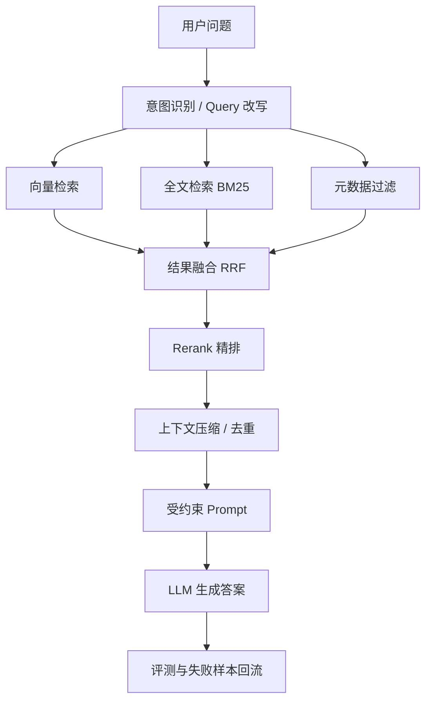

# RAG 技术小结

## 一句话总结

RAG 是把外部知识检索出来并注入大模型上下文的工程系统，核心质量取决于“索引是否合理、召回是否全面、重排是否精准、生成是否忠实、评测是否可量化”。

## 核心结论

1. **RAG 解决的是模型知识不足问题。** 当问题依赖企业知识、实时资料、长文档或专业语料时，需要把相关资料检索出来交给模型。

2. **RAG 的基础链路是索引、检索、生成。** 离线把文档切块、向量化、入库；在线把用户问题检索成相关上下文，再交给模型回答。

3. **RAG 的目标不是让模型“记住知识”。** 它是在每次回答时临时提供可用资料，让模型基于资料生成答案。

4. **Native RAG 是最小可用版本。** 文档转文本、切块、向量化、Top-K 检索、拼接上下文、生成答案，是最基础的 RAG。

5. **Advanced RAG 重点优化检索前后。** 检索前做 Query 改写、意图识别、过滤；检索后做去重、融合、Rerank 和上下文压缩。

6. **Modular RAG 是工程化架构。** 它把切分、索引、召回、重排、生成、评测拆成可替换模块，便于按业务场景组合。

7. **索引质量决定召回上限。** 文档切分太粗会引入噪音，切分太细会丢上下文；索引描述不清，后面检索再强也难补救。

8. **知识增强适合弥合文档和用户提问的表达差异。** 可以把原始文档抽取成 FAQ、知识点、摘要、同义问法和元数据，提高召回概率。

9. **FAQ 嵌入方式要看问答关系。** 如果问题和答案强相关，可以只嵌入问题；如果答案包含大量关键语义，应考虑 Q+A 拼接或单独构建答案索引。

10. **分块策略没有统一最优解。** 字符切分简单但粗糙，结构切分更稳，语义切分更智能但成本更高，LLM 切分适合高价值低频知识。

11. **Markdown、代码、PDF、网页应使用不同切分策略。** 文档结构不同，标题、段落、函数、表格和页面层级都应成为切分依据。

12. **Small-to-Big 能缓解切块丢上下文。** 先检索小块命中精准信息，再通过 parentID 取回更大的父块提供完整上下文。

13. **向量检索适合语义相似问题。** 它能处理同义表达和概念接近的问题，但对错误码、型号、人名、专有名词可能不够稳定。

14. **全文检索适合字面精确匹配。** BM25、倒排索引等方法对错误码、产品型号、函数名、专有名词更可靠。

15. **混合检索通常比单一路径更稳。** 向量召回负责语义，全文检索负责字面，二者合并后用 RRF 或 Rerank 统一排序。

16. **RRF 是轻量级融合方法。** 它不依赖额外模型，可以把多路检索结果按排名融合，适合做初步去重和排序。

17. **Rerank 是二阶段精排。** 先用便宜方法多召回，再用更精准模型从候选文档中选出最相关的 3 到 5 条。

18. **Cross-Encoder Rerank 精度高但成本高。** 它把 Query 和文档一起输入模型计算相关性，适合候选数量较少、准确率要求高的场景。

19. **Bi-Encoder 更常用于召回或粗排。** 它速度快、可预计算文档向量，但 Query 和文档缺少深度交互，精度通常低于 Cross-Encoder。

20. **多向量方法介于召回和精排之间。** ColBERT 类 late interaction 方法保留词级交互，速度和精度折中，但存储成本更高。

21. **漏斗型检索架构更符合生产实践。** 常见流程是多路召回 100 条，轻量重排到 20 条，再用 Cross-Encoder 精排到少量上下文。

22. **Query 改写能提高召回率。** 把模糊问题扩展成多个具体问题，可以覆盖定义、对比、场景、限制条件等不同检索角度。

23. **Query 改写必须防止跑题。** 改写应围绕原问题的核心实体、同义词、上下文补全和拆解，不应扩展到泛泛概念。

24. **历史对话对改写很关键。** “他”“这个”“上次那个”必须根据上下文还原成具体实体，否则检索会失焦。

25. **意图识别是检索路由入口。** 系统可以根据问题类型选择向量检索、全文检索、图检索、SQL 查询或多路混合检索。

26. **元数据过滤能显著提升召回质量。** 时间、产品线、版本、地区、权限、文档类型等字段应在检索前后参与过滤。

27. **GraphRAG 适合全局和关联型问题。** 当问题需要跨多个文档总结、实体关系推理或全局概览时，图结构比普通 chunk 检索更有优势。

28. **GraphRAG 成本高，不是默认选择。** 它需要实体抽取、关系抽取、图构建、社区检测、摘要维护和更新机制，适合高价值知识库。

29. **GraphRAG 的核心是结构化抽取 + 图算法 + 预摘要。** 它把文本转成实体关系图，再通过社区和摘要帮助回答宏观问题。

30. **混合路由比单一选型更现实。** 具体事实问答走传统 RAG，宏观总结和多跳关联走 GraphRAG，可以兼顾速度、成本和深度。

31. **生成阶段必须约束忠实性。** Prompt 应要求模型仅基于检索资料回答，无法得出时说明资料不足，并尽量给出引用来源。

32. **上下文越多不一定越好。** 无关内容会干扰模型，长上下文还可能触发 lost-in-the-middle 问题，导致关键资料被忽略。

33. **RAG 系统必须评测检索和生成两部分。** 只看最终答案无法知道问题出在召回、重排、上下文组织还是生成。

34. **检索评测关注上下文是否找对。** 典型指标包括 context precision、context recall、命中率、MRR、nDCG 等。

35. **生成评测关注回答是否忠实和相关。** 典型指标包括 faithfulness、answer relevancy、正确性、引用准确性和用户满意度。

36. **RAGAS 是常见的 RAG 评测框架。** 它用问题、答案、上下文和标准答案等数据，评估检索质量和生成质量。

37. **ground truth 是高质量评测的关键瓶颈。** 业务 Query、标准答案、应召回文档通常需要人工先做一版，再用 LLM 辅助扩充。

38. **RAG 优化必须基于失败样本。** 发现答错后，要判断是没召回、召回排序低、上下文太乱、Prompt 约束弱，还是模型生成阶段幻觉。

## 补充结论

1. **Bi-Encoder 更适合召回或粗排，不是严格意义上的精排。** 双塔模型的优势是快和可预计算，适合作为一阶段召回层；真正的精排通常使用 Cross-Encoder 或其他能让 Query 与文档充分交互的模型。

2. **Cross-Encoder 的准确表述是“拼接后共同编码”。** 它通常把 Query 和文档拼接后一起输入 Transformer，通过自注意力让二者在模型内部充分交互，再输出相关性分数。

3. **RAGAS 指标要以当前版本为准。** 常见指标包括 faithfulness、answer relevancy、context precision、context recall；不同版本中指标命名和实现可能变化，落地时不要死记旧名称。

4. **context precision 是否依赖 ground truth 取决于实现。** 它通常评估检索上下文中有多少内容对回答有用，某些实现会结合参考答案评估，不能简单理解成固定需要或不需要 ground truth。

5. **向量检索不能替代全文检索。** 部分现代检索模型能同时捕捉语义和一定字面信息，但专有名词、型号、错误码仍建议使用 BM25 或混合检索兜底。

6. **GraphRAG 是可选模块，不是默认升级路线。** Modular RAG 可以包含 Native、Advanced、GraphRAG、SQL、工具检索等多种模块；GraphRAG 只适合特定结构化知识和全局推理场景。

## 推荐工程架构

## RAG 排障清单

1. **答案不相关：** 先查 Query 是否改写跑题，再查 Top-K 是否召回正确文档。
2. **答案编造：** 检查 Prompt 是否要求基于上下文回答，是否允许资料不足时拒答。
3. **引用不准：** 检查 chunk 是否保留来源 ID、标题、URL、页码等元数据。
4. **召回漏专有名词：** 加全文检索或关键词过滤，不要只靠向量。
5. **召回太多噪音：** 加 Rerank、元数据过滤、去重和上下文压缩。
6. **宏观问题答不好：** 考虑父子 chunk、文档摘要、GraphRAG 或预生成主题摘要。
7. **多轮问题失焦：** Query 改写阶段加入历史对话，补全代词和省略实体。
8. **优化没方向：** 建立 Query、标准答案、应召回文档三类 benchmark。

## 最终理解

RAG 的难点不在“接一个向量库”，而在把知识组织成可检索、可排序、可引用、可评测的系统。真正可用的 RAG 通常是多路召回、融合排序、精排压缩、受约束生成和持续评测共同作用的结果。
