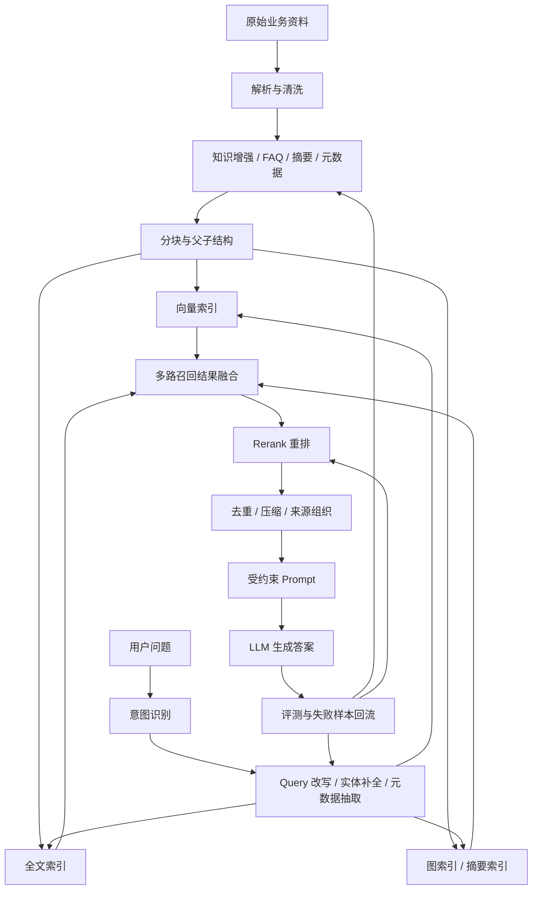

# RAG 技术小结

## 一、问题背景

RAG（Retrieval-Augmented Generation，检索增强生成）是大模型业务落地中最常见、也最容易见效的技术路径。

原因很直接：绝大多数业务都有自己的私有知识，比如产品文档、客服 FAQ、代码库、制度流程、业务配置、行业资料。大模型本身不知道这些知识，但可以在回答前先把相关资料检索出来，再把资料和用户问题一起交给模型生成答案。

所以 RAG 解决的不是“让模型重新训练一遍业务知识”，而是：

> 在每次回答时，把外部知识按需检索出来，临时注入模型上下文，让模型基于检索资料回答。

一个基础 RAG 链路通常几天就能搭起来，但真正难的是后续效果优化。大多数问题不在模型本身，而在：

- 数据源质量不稳定。
- 文档解析不完整。
- 切片策略不合理。
- 用户问题和文档表达不一致。
- 召回不全。
- 排序不准。
- 上下文噪音太多。
- 生成阶段没有忠实约束。
- 缺少可量化评测。

## 二、核心结论

RAG 的工程质量不是由“有没有向量库”决定的，而是由完整链路共同决定的：

```text
数据准备
  → 知识增强
  → 文档切片
  → 索引构建
  → 意图识别
  → Query 改写
  → 多路召回
  → 结果融合
  → Rerank 重排
  → 上下文组织
  → 受约束生成
  → 评测与失败样本回流
```

> [!summary] 核心判断
> RAG 是一个“知识组织 + 检索排序 + 受控生成 + 持续评测”的工程系统，不是简单把文档切块后塞进向量数据库。

## 三、RAG 的基础链路

RAG 最基础的链路可以拆成三步：

```text
Index：索引构建
Retriever：检索召回
Generation：生成答案
```

### 1. 索引构建

把业务知识转成可检索的形式。

常见过程是：

```text
PDF / Word / Markdown / HTML / 音视频
  → 统一解析成文本或结构化内容
  → 按规则切分成文档块
  → 对文档块生成 Embedding
  → 写入向量库、全文索引库或图数据库
```

### 2. 检索召回

用户输入问题后，系统把 Query 转成向量或关键词，去知识库中找相关内容。

常见方式包括：

- 向量检索：适合语义相似。
- 全文检索：适合关键词、专有名词、型号、错误码。
- 图检索：适合实体关系、多跳推理、全局总结。
- 元数据过滤：适合时间、行业、产品线、权限等限定条件。

### 3. 生成答案

把用户问题和召回上下文交给大模型，让模型基于资料生成最终答案。

生成阶段的关键不是“让模型自由发挥”，而是要约束模型：

- 只能基于检索上下文回答。
- 资料不足时明确说明无法判断。
- 尽量给出来源、文档、页码或引用。
- 不要把常识和检索资料混在一起胡编。

## 四、RAG 的三阶段演进

RAG 常见演进路线可以分成三类。

### 1. Native RAG：最小可用链路

Native RAG 是最基础的 RAG：

```text
文档转文本
  → 切块
  → 向量化
  → Top-K 检索
  → 拼接上下文
  → LLM 生成
```

它的优点是简单、落地快。

缺点也明显：

- Query 表达稍微复杂就容易召回不全。
- 文档切片质量直接决定召回上限。
- 只靠向量检索容易漏掉专有词。
- Top-K 结果经常混入噪音。
- 生成阶段容易被无关上下文干扰。

Native RAG 适合作为 MVP，但不适合作为复杂业务的最终形态。

### 2. Advanced RAG：检索前后增强

Advanced RAG 在基础链路上增加两个方向的优化：

```text
检索前增强
  → 意图识别、Query 改写、实体补全、元数据抽取

检索后增强
  → 多路召回、结果融合、Rerank、去重、上下文压缩
```

例如用户问：

```text
直通车和全站推哪个效果更好？
```

如果直接检索，可能只召回“直通车”相关内容，漏掉“全站推”。

更稳的做法是改写成多路 Query：

```text
直通车是什么？
全站推是什么？
直通车和全站推有什么区别？
直通车和全站推哪个效果更好？
```

然后分别召回，再融合排序。

### 3. Modular RAG：模块化组合

Modular RAG 不是一种单独算法，而是一种工程架构。

它把 RAG 链路拆成可替换模块：

- 数据解析模块。
- 知识增强模块。
- 分块模块。
- 向量索引模块。
- 全文索引模块。
- 图索引模块。
- 意图识别模块。
- Query 改写模块。
- 多路召回模块。
- Rerank 模块。
- 生成约束模块。
- 评测模块。

不同业务可以组合不同链路。

比如：

- 客服 FAQ：Query 改写 + 向量检索 + BM25 + Rerank。
- 代码问答：代码结构解析 + 功能描述索引 + 语义检索。
- 政策法规：结构化标题层级 + 精确关键词 + 条款级召回。
- 全局总结：GraphRAG / 文档摘要 / 主题摘要。

Modular RAG 的价值是让系统从“固定 pipeline”变成“可编排检索系统”。

## 五、索引构建：RAG 质量的上限

索引阶段决定召回上限。

如果索引质量差，后面再强的 Rerank 也只能在错误候选里排序。

### 1. 知识增强

原始文档和用户问题之间通常存在表达差异。

例如产品文档可能这样写：

```text
本产品支持多渠道经营数据聚合与门店经营分析。
```

用户可能这样问：

```text
数字门店怎么落地？
```

两者语义相关，但字面表达差异很大。单纯向量检索不一定稳定召回。

知识增强的作用是把原始文档转成更容易被用户问题命中的索引形式。

常见方式包括：

- 从文档中抽取 FAQ。
- 生成类似问法。
- 提取知识点摘要。
- 提取功能描述。
- 提取适用场景。
- 提取实体、时间、行业、产品线等元数据。

客服知识库里传统上由运营手动整理 FAQ，本质上就是人工知识增强。现在可以用 LLM 辅助把文档转成结构化问答、摘要和索引字段。

### 2. 代码知识增强

代码类知识库不能只把源码按字符切片。

更有效的索引通常包括：

- 功能能力。
- 使用场景。
- 输入输出。
- 关键实现逻辑。
- 依赖关系。
- 作者或模块归属。

用户问“这个广告投放逻辑怎么复用”时，召回的可能不是原始代码片段，而是代码对应的功能描述和使用方式。

### 3. 分块策略

分块没有统一最优解。

常见层级可以从粗到细理解：

| 分块方式 | 特点 | 适用场景 |
|---|---|---|
| 字符 / Token 硬切 | 简单但容易切断语义 | MVP、低价值文档 |
| 段落 / 标题切分 | 保留基础结构 | Markdown、网页、普通文档 |
| 文档格式切分 | 按格式特征切 | PDF、Word、代码、表格 |
| 语义切分 | 按语义边界切 | 高价值知识库 |
| LLM 切分 | 让模型判断切点 | 低频、高价值、复杂文档 |

切太大，噪音多；切太小，丢上下文。

工程上通常需要结合父子分块或 Small-to-Big：

```text
先检索小块
  → 命中精准信息
  → 再扩展到父段落、父章节或完整文档
  → 给模型更完整上下文
```

### 4. FAQ 向量化方式

FAQ 是否只嵌入问题，取决于问答关系。

- Q 和 A 强相关：只嵌入问题更精准。
- A 中包含大量关键语义：可以嵌入 Q+A。
- 答案较长且多知识点：可以拆出多个知识点索引。

不要机械地把所有 FAQ 都做同一种 Embedding。

## 六、检索链路：从单路召回到多路融合

### 1. 意图识别

意图识别是检索路由入口。

它可以解决几类问题：

- 闲聊、打招呼、固定业务策略，不必进入完整 RAG。
- 根据行业、产品线、场景切换知识库。
- 抽取时间、地区、产品、实体等元数据用于过滤。
- 决定后续使用向量检索、全文检索、图检索还是混合检索。

例如用户问“今年的政策有什么变化”，系统应先抽取“今年”这个时间限制，再参与后续过滤。

### 2. Query 改写

Query 改写的目标是把“不适合检索的问题”改成“更容易被知识库命中的问题”。

常见改写包括：

- 对比问题拆解。
- 省略实体补全。
- 历史对话代词消解。
- 同义词扩展。
- 业务限定词补全。
- 常识问题具体化。

例如：

```text
转账失败了
```

可以结合业务改写成：

```text
支付宝转账失败怎么办？
微信转账失败怎么办？
银行卡转账失败怎么办？
```

改写要防止跑题。它应该围绕原问题的核心实体和真实意图展开，而不是把问题泛化成无边界概念。

### 3. 多路召回

成熟 RAG 通常不是单一路径召回，而是多路召回：

```text
向量召回
  → 语义相似

全文召回
  → 关键词、专有名词、错误码、型号

图召回
  → 实体关系、全局总结、多跳关联

元数据过滤
  → 时间、行业、版本、权限、地区
```

向量检索不能替代全文检索。

Embedding 能捕捉语义相似，但对强字面匹配场景仍不如倒排索引稳定，例如：

- 错误码。
- 法规条款号。
- 产品型号。
- 函数名。
- 人名、组织名。
- 行业术语。

### 4. GraphRAG 的适用边界

GraphRAG 适合回答全局型、关系型、多跳型问题。

它通常包括：

```text
文档分块
  → 实体抽取
  → 关系抽取
  → 图构建
  → 社区检测
  → 社区摘要
  → Local / Global 检索
```

图检索可以区分：

- Local：围绕具体实体、节点和邻居扩展。
- Global：围绕抽象概念、主题社区和摘要检索。

但 GraphRAG 成本高，不应默认上。

它更适合高价值知识库，尤其是需要跨文档总结和实体关系推理的场景。

## 七、Rerank 与结果融合

召回阶段的目标是“尽量别漏”，排序阶段的目标是“把真正有用的排到前面”。

因为最终能塞给模型的上下文有限，所以 Rerank 很关键。

### 1. 小模型 Rerank

常见做法是使用 BGE 等排序模型，对候选文档和 Query 计算相关性。

优点：

- 速度较快。
- 成本低。
- 可以业务微调。
- 适合从 100 条候选压到 20 条。

缺点：

- 容易把“语义相似但答案无关”的文档排前。

例如用户问：

```text
营业执照丢了怎么办？
```

召回到：

```text
营业执照副本上的公章为钢印公章时，需要复印并拍照上传。
```

这两个文本都和“营业执照”相关，但后者并不能回答“丢了怎么办”。

### 2. 大模型 Rerank

大模型 Rerank 更适合处理“语义相似但实质无关”的候选。

常见方式包括：

1. **二分类判断**

   对每个候选判断“相关 / 不相关”。

2. **反向生成 Query**

   根据文档生成“用户可能问什么”，再和原 Query 比较。

3. **直接排序**

   输入多个候选，让模型给出排序结果。

工程上常见漏斗是：

```text
多路召回 100 条
  → 小模型 Rerank 到 20 条
  → 大模型 Rerank 到 3-6 条
  → 组织上下文生成答案
```

### 3. 规则融合

不一定所有融合都要模型参与。

常见规则包括：

- 各路召回排名加权。
- 来源权威性加权。
- 时间新鲜度加权。
- 文档类型加权。
- 业务优先级加权。

RRF 这类基于排名的融合方式，适合把多路召回结果进行轻量合并。

## 八、生成阶段：忠实性约束

生成阶段的关键是让模型基于上下文回答，而不是凭常识补全。

Prompt 应该明确：

- 只能根据给定上下文回答。
- 上下文不足时说明资料不足。
- 输出需要引用来源。
- 不要猜测缺失事实。
- 如果上下文冲突，需要说明冲突。

上下文不是越多越好。

无关上下文会带来两个问题：

- 干扰模型判断。
- 让关键资料被埋在长上下文中，出现 lost-in-the-middle。

所以生成前还需要做：

- 去重。
- 压缩。
- 排序。
- 来源标注。
- 上下文分组。

## 九、RAG 评测体系

RAG 必须评测两件事：

```text
检索是否找对资料
生成是否忠实回答
```

只看最终答案，很难知道问题出在哪里。

### 1. 端到端评测

端到端评测关注用户最终体验。

常见指标包括：

- 回答是否相关。
- 回答是否准确。
- 回答是否清晰。
- 是否满足用户问题。
- 格式是否友好。
- 是否有参考价值。

可以用人工或 LLM-as-a-Judge 做 0/1/2 分评分。

### 2. 检索阶段评测

检索评测关注召回上下文是否正确。

核心数据是：

```text
Query
  ↔ 能回答该 Query 的正确 Context
```

常见指标包括：

- 命中率。
- Context Recall。
- Context Precision。
- MRR。
- nDCG。

如果标准答案中需要的信息没有被召回，生成阶段再强也无法稳定答对。

### 3. 生成阶段评测

生成评测关注答案是否忠实、是否解决问题。

常见指标包括：

- Faithfulness：答案是否能从上下文推出。
- Answer Relevancy：答案是否真的回答了问题。
- Answer Correctness：是否符合标准答案。
- 引用准确性。
- 幻觉率。

例如事实相关性可以这样评估：

```text
把 Answer 拆成多个陈述句
  → 判断每个陈述句是否能从 Context 推出
  → 不能推出的部分视为幻觉风险
```

### 4. Benchmark 是优化前提

业务中至少要维护两类 Benchmark：

1. **召回 Benchmark**

   ```text
   Query ↔ 应召回的正确 Context
   ```

2. **回答 Benchmark**

   ```text
   Query ↔ 标准 Answer
   ```

第一版通常需要人工标注，后续可以用 LLM 辅助扩充，但不能完全依赖自动生成。

每个子模块也要能单独评测：

- Query 改写。
- 意图识别。
- 分块策略。
- 召回数量。
- Rerank。
- 生成 Prompt。

没有评测，RAG 优化会变成凭感觉调参。

## 十、推荐工程架构



## 十一、RAG 排障清单

1. **答案不相关**

   先看 Query 是否改写跑题，再看 Top-K 是否召回正确文档。

2. **召回漏内容**

   检查分块是否切断语义、关键词是否缺失、是否需要 BM25 或元数据过滤。

3. **召回全是噪音**

   检查索引是否太粗、Top-K 是否过大、是否缺少 Rerank。

4. **专有名词召回差**

   不要只靠向量检索，增加全文检索、术语词库或关键词过滤。

5. **对比类问题答不好**

   增加 Query 拆解，把 A、B 和“区别”分别召回。

6. **多轮问题失焦**

   Query 改写阶段要结合历史对话，把“它”“这个”“上次那个”还原成具体实体。

7. **答案编造**

   检查 Prompt 是否限制只能基于上下文回答，是否允许资料不足时拒答。

8. **引用不准**

   检查 chunk 是否保留来源 ID、标题、页码、URL 等元数据。

9. **宏观总结答不好**

   考虑文档摘要、父子分块、GraphRAG 或主题社区摘要。

10. **优化没方向**

    建立召回 Benchmark 和回答 Benchmark，用失败样本驱动优化。

## 十二、总结

RAG 的难点不在“接一个向量库”，而在把业务知识组织成可解析、可切片、可检索、可排序、可引用、可评测的工程系统。

Native RAG 可以快速验证业务价值；Advanced RAG 解决检索前后的质量问题；Modular RAG 让不同索引、召回、重排和评测模块可以按业务组合。

一句话概述：

> RAG 的核心不是让模型记住知识，而是在每次回答时把最相关、最可信、最少噪音的外部知识交给模型，并通过评测不断修正检索和生成链路。
