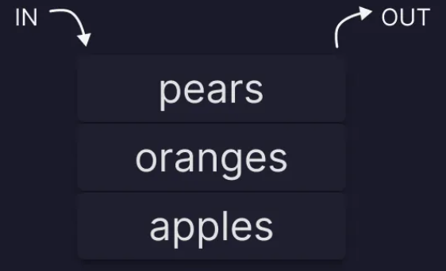

<!--
 * @Date: 2022-01-05 01:40:32
 * @LastEditors: Lewis
 * @LastEditTime: 2022-01-07 15:45:00
     -->
## 1-栈

注：以下内容参考了《数据结构与算法JavaScript描述》以及《30 seconds of code》

栈是一种特殊的列表，栈内的元素只能通过列表的一端访问，这一端称为**“栈顶”**，对于栈的两种操作，一种是将一个元素压入栈 被称之为**"压栈"**，另一种是将一个元素弹出栈 被称之为 **“弹栈”**，栈遵循**先进后出 (LIFO)**的原则，即我们将元素 A B C 依次压入栈，那么取出来的时候就只能从 C开始依次取出，即 C B A

**代码示例：** ./01-栈.html

## 2-队列

队列也是一种列表，与栈不同的是，队列只能再队尾插入元素 即**“入队”**，队首删除元素 即**“出队” **，队列遵循**“先进先出”(FIFO) **，听名字其实就能联想到现实生活中的排队，例如食堂打饭 第一个排队的总是第一打完出来的，队列的最后一位总要等到前面的所有人打完才可以打饭这就是一个队列。

**代码示例：** ./02-队列.html

### 2.1优先队列

在一般情况下，从队列中删除的元素，一定是率先入队的元素。但是也有一些使用队列的应用，在删除元素时不必遵守先进先出的约定。这种应用，需要使用一个叫做**优先队列**的数据结构来进行模拟。 从优先队列中删除元素时，需要考虑优先权的限制。比如医院急诊科的候诊室，需要判断病人的病情严重程度来进行优先级划分，高优先级的患者优先于低优先级的患者进行就医。

**代码示例：** ./03-优先队列.html

### 2.2 双向队列

即可以从两端进行添加和删除元素的队列，即为双向队列。代码其实用JavaScript中的数组实现也非常简单，略。