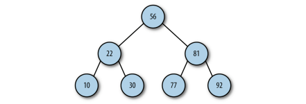

<!--
 * @Description: 树
 * @Date: 2022-01-07 16:30:28
 * @Author: luoshuai
 * @LastEditors: luoshuai
 * @LastEditTime: 2022-01-07 16:30:28
  -->

# 二叉树和二叉查找树

概述：树是计算机科学中经常用到的一种数据结构。树是一种非线性数据结构，以分层的方式存储数据。因此被用来存储具有层级关系的数据，比如文件系统中的文件。本章将研究一种特殊的树：**二叉树** 

> **二叉树 **的每个子节点不许超过两个，**二叉查找树** 是一种特殊的二叉树，相对较小的值保存在左节点，较大的值保存在右节点中。通过这个特点使得其在插入、查找、删除数据时都可以非常高效。

特点：

1. 对比链表，在二叉树上进行查找非常快
2. 对比数组，在二叉树中进行添加或者删除的操作也非常快

